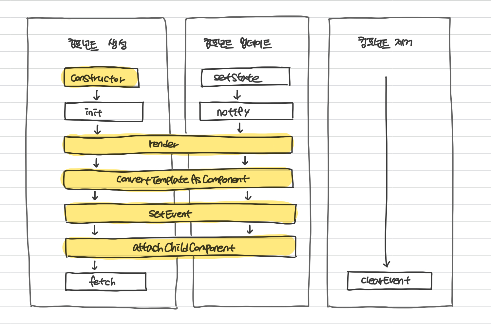

# Vanilla-Component
바닐라 타입스크립트로 컴포넌트 패턴의 상태 기반 렌더링 방식 구현하기 😊

## 관련 포스팅 📚
- [바닐라로 상태 기반 렌더링 컴포넌트 만들기 1 - 왜 상태 기반 렌더링을 하게 됐을까?](https://velog.io/@surim014/vanilla1)
- [바닐라로 상태 기반 렌더링 컴포넌트 만들기 2 - 상태 기반 렌더링은 어떻게 하는걸까?](https://velog.io/@surim014/vanilla2)
- [바닐라로 상태 기반 렌더링 컴포넌트 만들기 3 - 환경 설정하기 (feat. 보일러 플레이트)](https://velog.io/@surim014/vanilla3)
- [바닐라로 상태 기반 렌더링 컴포넌트 만들기 4 - 코어 컴포넌트 만들기](https://velog.io/@surim014/vanilla4)
- [바닐라로 상태 기반 렌더링 컴포넌트 만들기 5 - 코어 컴포넌트 사용해보기](https://velog.io/@surim014/vanilla5)

<br>

## 프로젝트 실행 방법 🦾
```
npm install

npm run dev
```

<br>

## Component Life Cycle ♻️


<br>

## Component 컨셉 🧐
- Observer 패턴의 구독, 알림 형태를 차용하여 **부모의 상태를 구독한 컴포넌트만 부모 컴포넌트의 상태를 추적합니다.**
- `preventRenderStateKey`에 있는 state key가 변경이 되는 경우, **현재 컴포넌트는 상태만 변경이 되고 렌더링은 진행되지 않습니다.**

<br>

## Core Component Data 🔧
  - **`node`**: 컴포넌트의 node
  - **`initalState`**: 컴포넌트 상태의 초기값
  - **`preventRenderStateKey`**: 구독중인 컴포넌트의 상태 변경 시, 내부적으로 상태만 업데이트 후 자식 컴포넌트만 렌더링하기 위한 key
  - **`needRender`**: 컴포넌트의 상태 변경에 따른 렌더링 여부
  - **`needUpdate`**: 컴포넌트의 상태 변경에 따른 setState 여부
  - **`subscribers`**: 컴포넌트 상태 변경 시, 상태가 같이 변경될 하위 컴포넌트

## Core Component Method 🔧
  - **`template()`**: 컴포넌트의 markup을 반환하는 메서드
  - **`init()`**: 렌더링 전, 내부적으로 사용될 변수, 함수 정의 또는 초기 데이터를 받아올 때 사용되는 라이프사이클 메서드
  - **`fetch()`**: 초기 렌더링 이후 컴포넌트의 fetching이 필요할 때 실행되는 라이프 사이클 메서드
  - **`render()`**: 빈 태그를 컴포넌트의 markup으로 변환, 이벤트를 바인딩, 하위 컴포넌트를 부착을 하는 라이프 사이클 메서드
  - **`update()`**: 상태 변경 시, 렌더링을 위한 라이프사이클 메서드
  - **`updateChildren()`**: 상태 변경 시, 하위 컴포넌트의 렌더링을 위한 라이프 사이클 메서드
  - **`attachChildComponent()`**: 하위 컴포넌트를 상위 컴포넌트의 template과 연결하는 라이프 사이클 메서드
  - **`subscribe()`**: 상위 컴포넌트에 구독을 하는 메서드
  - **`validationState`**: 컴포넌트의 상태 변경 시, 현재 컴포넌트가 가지고 있는 상태인지 판별하는 메서드
  - **`setState()`**: 컴포넌트의 상태 변경 시, 컴포넌트의 상태를 업데이트, 하위 컴포넌트들에게 알리는 메서드
  - **`notify()`**: 상위 컴포넌트로부터 받은 새로운 상태로 하위 컴포넌트들의 setState(), render()하게 해주는 메소드
  - **`setEvent()`**: 컴포넌트의 node에 이벤트를 바인딩하는 라이프 사이클 메서드
  - **`clearEvent()`**: 컴포넌트의 node에 바인딩되어 있는 이벤트를 지우는 라이프 사이클 메서드